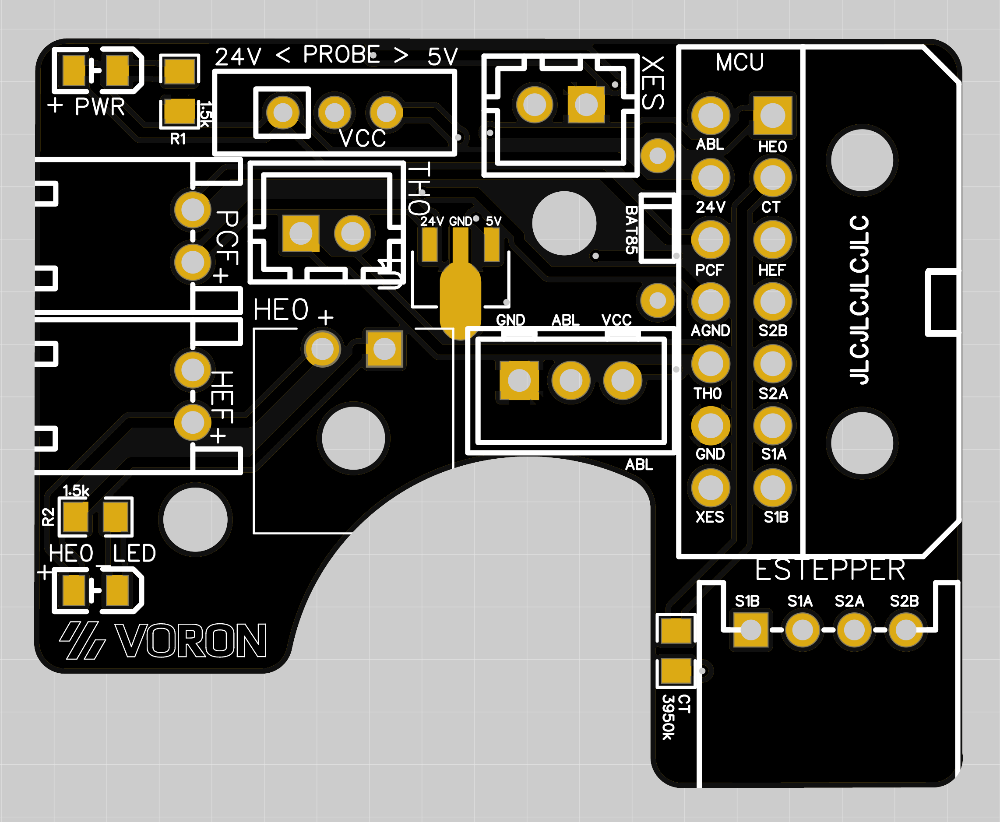

# Afterburner Toolhead Board #
modified version from hartk1213 (https://github.com/hartk1213/MISC/tree/main/3D-Printing/PCBs/Afterburner_Toolhead_PCB)

## This is rev 1.0 (produktion files coming soon!)

 [Here](https://github.com/hartk1213/MISC/blob/main/3D-Printing/PCBs/Afterburner_Toolhead_PCB/Images/Rev3.2/wiringDiagram.png) is the wiring diagram -> compatible wih Toolhead PCB rev. 3.2 from hartk1213

## The board has: ##
 - BAT85 Diode for abl probe
 - Switch to select 24v or 5v probe
 - Power LED
 - LED to show when hotend is on
 - 2/3/4 pin headers for most components on the toolhead
 - 2 Pin Microfit 3.0 for the heater
 - the hotend wiring harness connector is [Here](https://www.molex.com/molex/products/part-detail/crimp_housings/0436450200)
 - 0805 pkg thermistor to be used as a chamber temperature
 - 14 Pin Microfit 3.0 for the main connector back to the MCU
 - the main wiring harness connector is [Here](https://www.molex.com/molex/products/part-detail/crimp_housings/0430251400)
 - I used 0.5mm² for 24v, GND, and HE0 and 0.25mm² for everything else

This board was designed to make wiring the toolhead a bit easier, to help get rid of some of the crimps needs on these wires.

Since this board has provisions for the X endstop, this should be compatible with V1, V2, and Switchwire

### chamber thermistor config settings for klipper
 ## Config for rev 1.0
    #######################################
    #### Enclosure Temp Sensor Section ####
    #######################################
    [thermistor chamber_temp]
    temperature1: 25
    resistance1: 10000
    beta: 3950

	[temperature_sensor enclosure_temp]
    sensor_type: chamber_temp
    sensor_pin: PX.XX
    min_temp: 0
    max_temp: 100
    gcode_id: C

### [Here](https://github.com/hartk1213/MISC/blob/main/3D-Printing/PCBs/Afterburner_Toolhead_PCB/Images/Installation.png) is how the board and PCB spacer get installed using 2 M3x8 SHCS
