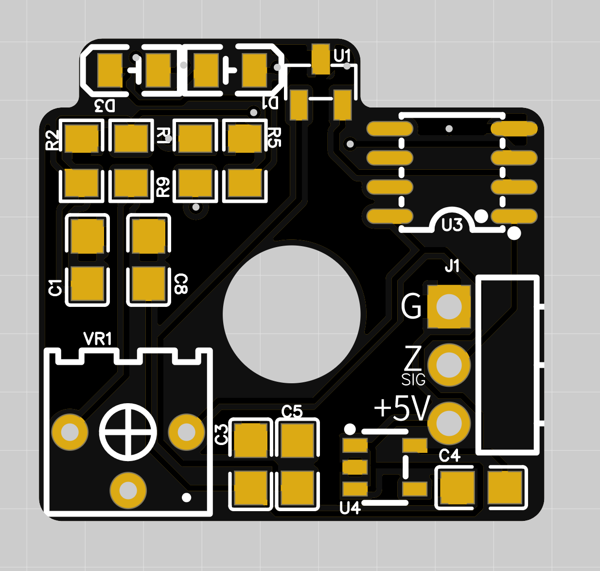

# Hall Effect Z Endstop for LQ #

Hall effect endstop board for Z axis

The Hall Effect board allows for contactless homing on the Z axis on a LQ. When hall sensor reaches close to magnet it produces a voltage.
The circuit then compares that with a reference voltage. T
he comparator flips based on threshold set using the trim pots. Please follow following procedure to setup Hall Effect Board.

1. Make sure both the pot is centered.
2. Then take a magnet for Z axis. Try both the poles. Find the pole of magnet that triggers sensor within 20mm of magnet.
3. Install the Z magnet into Z block.

## This is rev 1.0 (production files coming soon!)

