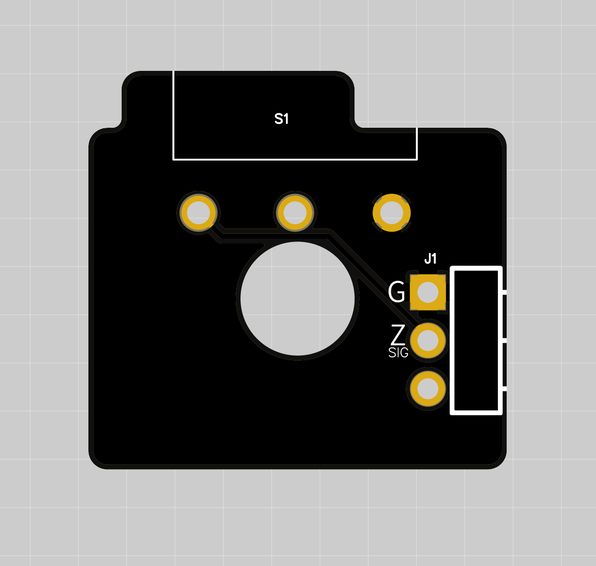

# Microswitch Z Endstop for LQ #

Microswitch endstop board for Z axis. Designed for Omron D2F-L switch, others might work as well. 
It is wire compatible with the hall effect board. The VIN pin is not used. If you have no intention of switching to the hall effect board, you can run 2 wires instead of 3.

## This is rev 1.0 (production files coming soon!)

